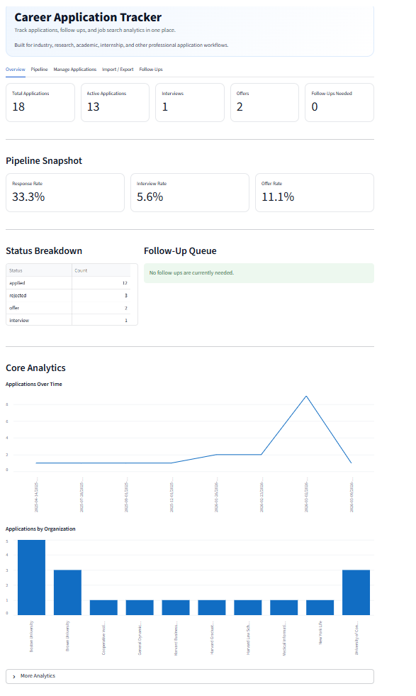

# Career Application Tracker

Career Application Tracker is a portfolio project that centralizes job and opportunity tracking into a structured, data-driven workflow. It supports industry roles, research positions, academic opportunities, internships, fellowships, and other professional applications through a clean Streamlit interface backed by SQLite, CSV import/export workflows, analytics, and automated follow-up reminders.

## Project Summary

Career Application Tracker helps replace a messy application process spread across job boards, email threads, notes, and spreadsheets with a single workflow-oriented dashboard. The app tracks application records, monitors statuses, flags follow-up opportunities, supports bulk CSV imports, generates follow-up email drafts, and visualizes pipeline analytics in one place.

---

---

## Dashboard Preview

---

## Overview

Career Application Tracker is a small full-stack data application built with:

- Python
- Streamlit
- SQLite
- Pandas
- Docker
- GitHub

The system helps manage applications across organizations, universities, and research groups while providing useful metrics and insights about the overall application pipeline.

---

## Core Features

### Application Tracking

Users can:

- add applications
- edit applications
- delete applications
- track status
- store contact information
- store notes and follow-up dates

Supported statuses:

- applied
- interview
- rejected
- offer

### Automated Follow-Up Detection

The system automatically flags applications that require follow-up.

An application is flagged when:

- status = applied
- at least 14 days have passed since application_date
- follow_up_date is blank

### Dashboard Metrics

The dashboard shows:

- Total Applications
- Active Applications
- Interviews
- Offers
- Follow-Ups Needed

### Application Analytics

The dashboard includes analytics for:

- applications by organization
- applications by company
- applications by job type
- applications by status
- applications over time
- response rate
- interview rate
- offer rate
- simple pipeline funnel views

### Bulk Import / Export

Applications can be:

- imported from CSV
- exported to CSV
- exported to Excel

The importer skips duplicates.

Duplicate detection currently uses:

- university
- job_title
- job_id
- application_date

### Follow-Up Email Draft Generator

For applications that require follow-up, the system generates a ready-to-send email draft that can be reviewed before sending.

---

## Project Structure

- app/
  - main.py
  - dashboard.py
  - database.py
  - models.py
  - utils.py
- data/
  - applications.db
- exports/
- scripts/
  - generate_import_template.py
  - import_applications.py
- tests/
- .streamlit/
  - config.toml
  - secrets.toml.example
- Dockerfile
- docker-compose.yml
- Procfile
- runtime.txt
- requirements.txt
- README.md
- .gitignore

---

## Database Fields

Each application record contains:

- university
- company
- department_lab
- job_title
- job_id
- location
- application_date
- status
- job_type
- interview_stage
- contact_name
- contact_email
- follow_up_date
- notes
- follow_up_needed

---

## Local Setup

Clone the repository:

git clone https://github.com/connorholliday5/app_tracker.git
cd app_tracker

Create a virtual environment:

py -3.11 -m venv .venv

Activate it:

.venv\Scripts\Activate.ps1

Install dependencies:

python -m pip install --upgrade pip
python -m pip install -r requirements.txt

Run the app:

python -m streamlit run app/main.py

Open:

http://localhost:8501

---

## Deployment

The repository includes configuration for deployment:

- Dockerfile
- docker-compose.yml
- Procfile
- runtime.txt
- Streamlit configuration

The application currently uses SQLite, which works well for local use and portfolio demonstrations.

---

## Why This Project Matters

This project demonstrates practical skills across multiple areas.

### Software Engineering

- modular Python architecture
- backend logic
- database interaction

### Data Engineering

- CSV ingestion pipeline
- duplicate-safe import
- data validation

### Data Analytics

- dashboard metrics
- trend visualization
- application analytics

### Product Thinking

- automated follow-ups
- workflow optimization
- user-focused UI design

---

## Future Improvements

Potential upgrades include:

- advanced filtering and saved views
- richer visual dashboard components
- reminder scheduling
- PostgreSQL support
- authentication and multi-user support
- deployment hardening for hosted environments

---

## Author

Connor Holliday

GitHub:
https://github.com/connorholliday5/app_tracker

